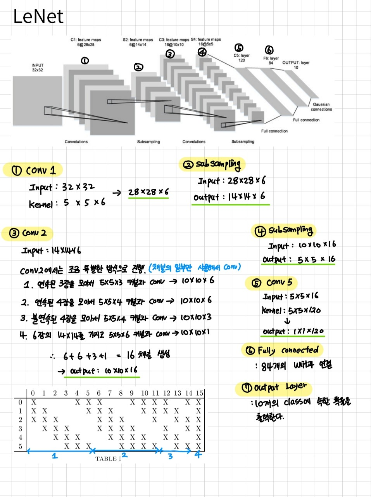

## LeNet

LeNet은 CNN의 근원이 되는 네트워크로 인풋레이어, 컨볼루션 레이어 3개, 서브샘플링 2개로 이루어져있다. 각 레이어에서의 입출력은 아래의 그림과 같으며 **특이한 점은 두 번째 컨볼루션 레이어에서 모든 피쳐 맵을 사용하는 것이 아닌 연속된 3장, 연속된 4장, 불연속된 4장, 모든 피쳐와 같이 채널의 일부만을 사용** 해서 컨볼루션 연산을 수행한다.

