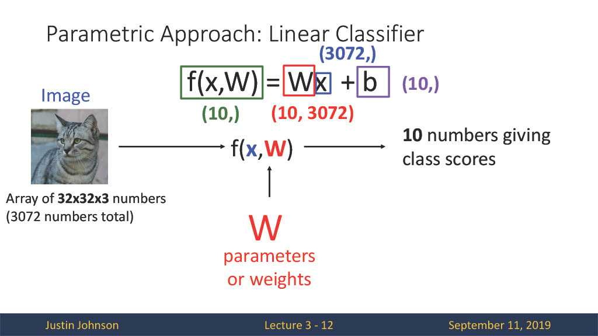
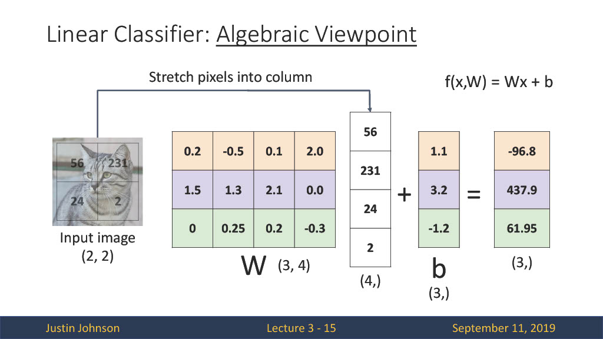
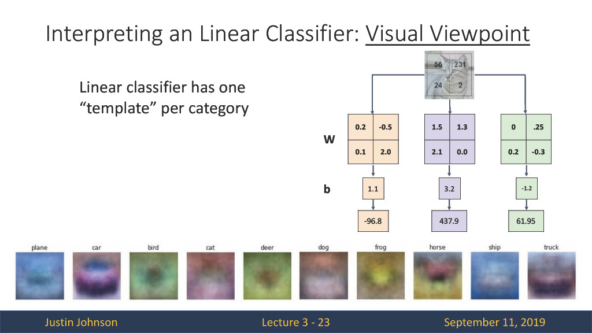
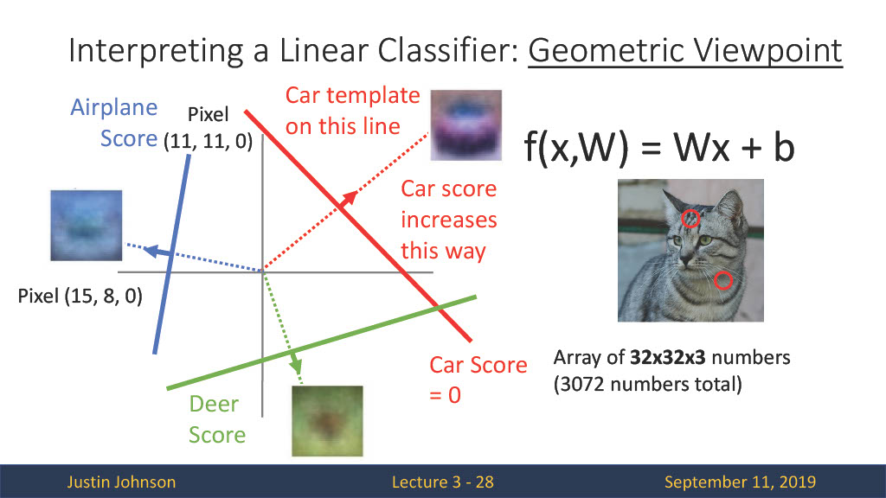
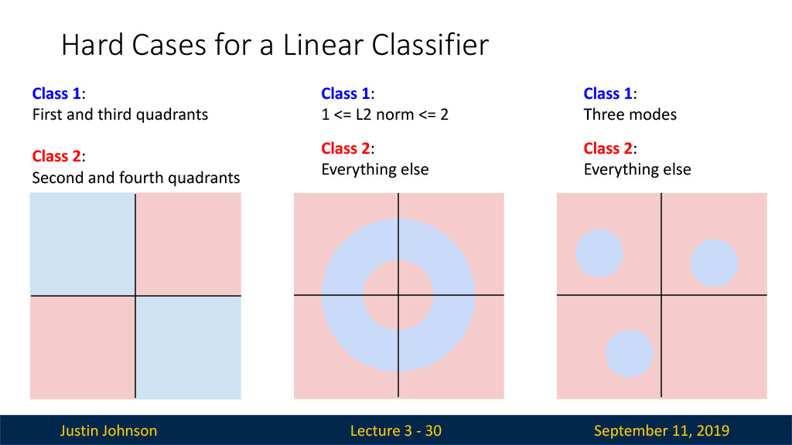
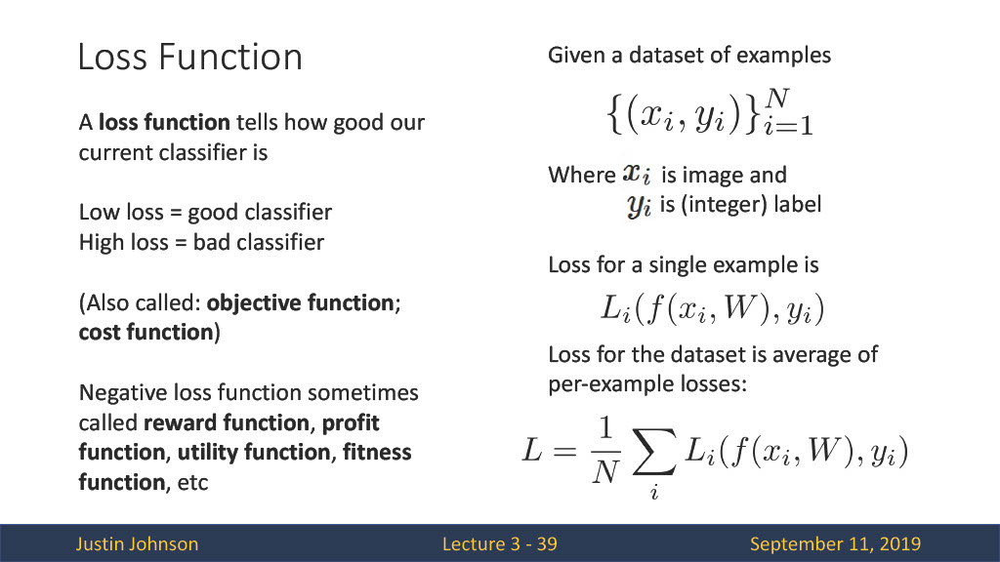
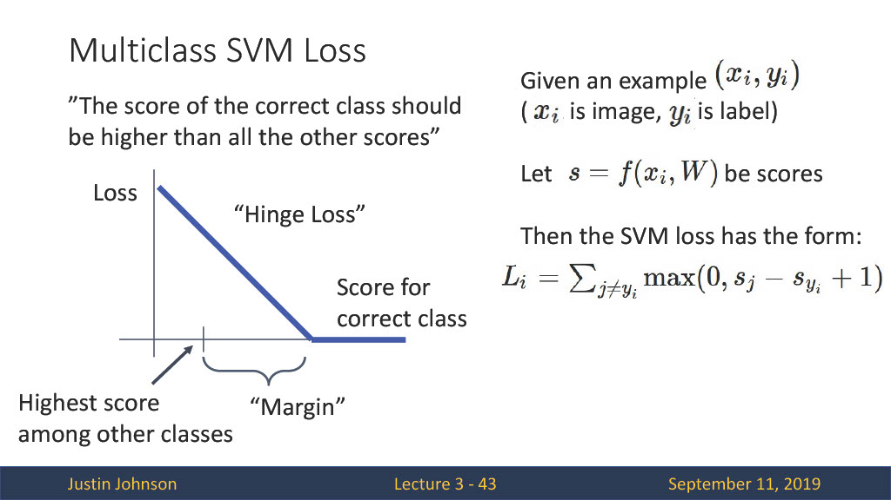
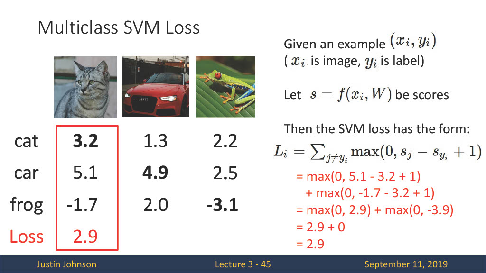
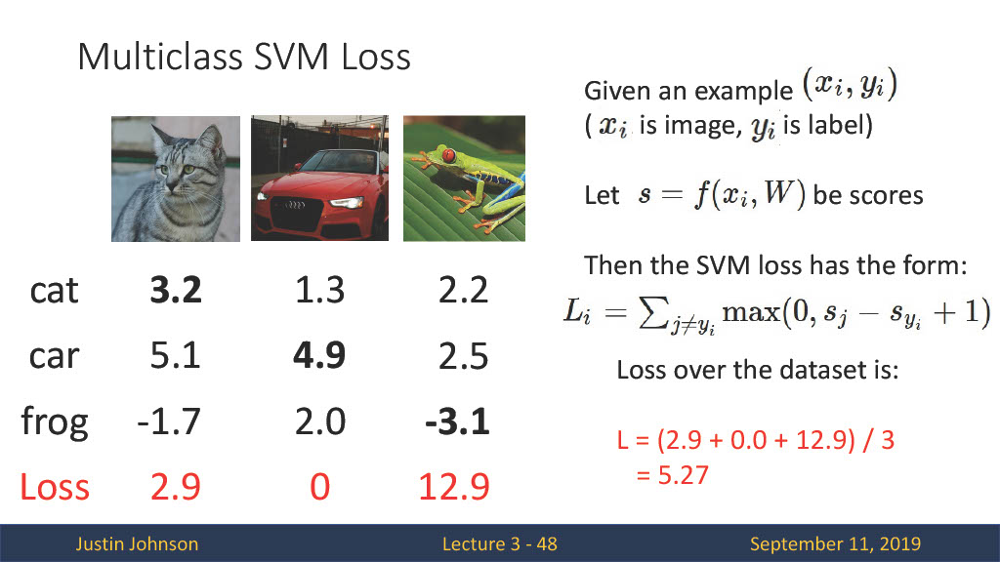
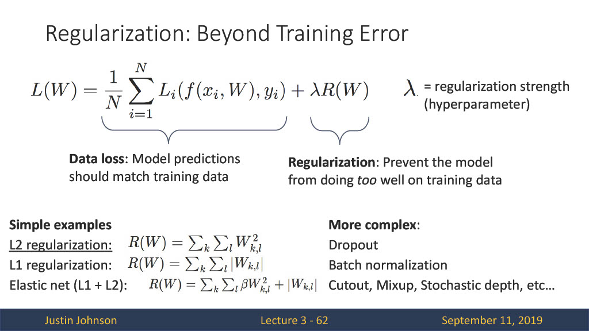

# 3. Linear Classifiers

## 선형 분류기

3장에서는 선형 분류 기법에 대해서 알아보고 이 모델이 최적의 파라미터를 가지기 위한 정량적 기법 loss function에 대해서도 알아보고자 한다.

위의 그림을 보면 (32x32x3)의 이미지가 입력되고(x), 최적의 모델을 찾기위해 조정되는 파라미터(W, b)값이 존재한다. 이때 출력으로 10개의 class score가 나와야 하므로 W값의 크기는 (10, 3072), b는 (10,0)으로 f = Wx + b의 크기를 충족할 수 있다.

이제 선형 분류기를 3가지의 관점을 통해 확인해보자.

### 1. Algebraic Viewpoint

행렬의 형태로 모든 값들을 표현하면 위와 같다. W, b 값을 초기화해주고 입력값과 계산하여 최종 score를 출력한다. 이때 출력에 해당하는 (3,)차원의 행렬이 각 class에 대한 score가 된다. 위에서 부터 1, 2, 3번 class라고 한다면 2번 class에 대한 score가 가장 높은 것을 확인할 수 있다. 방법에 따라 bias를 W 행렬 벡터에 추가해주고 flatten된 입력 이미지에 1을 추가해서도 score를 계산할 수 있다.

### 2. Visual Viewpoint

위의 그림은 선형 분류기를 통해 학습된 각 class의 template이다. 여기서 의미하는 것은 우리가 어떤 이미지를 예측하고자 한다면 위의 template과 가장 유사한 class로 예측을 하게 된다는 것이다. 하지만 하나의 template만을 사용하기 때문에 색, 방향 등에 따른 정확한 class를 예측하기 어렵다.

### 3. Geometric Viewpoint

## 선형 분류기의 한계

위의 초록색, 파란색 점을 분류할 수 있는 한 개의 직선이 없다. 즉, 선형 분류기는 XOR 문제를 해결하지 못하는 한계를 가진다.

지금까지 선형 분류기의 전체 흐름을 보았다. 여기서 생기는 궁금증은 그럼 파라미터 W, b 값은 어떻게 선택할 수 있을까이다.
또한 **선택된 파라미터가 현재 모델에 얼마나 적합한 모델인지, 판단할 수 있는 정량적인 값**이 필요하다. 이를 위해 Loss Function이라는 개념을 도입한다.

## Loss Function

단순한 Loss function을 살펴보면 현재 입력 데이터 x, 가중치 파라미터 W 값을 통해 나온 score, y_pred 값과 입력 데이터에 대한 정답값인 y값을 Loss function에 넣음으로써 loss를 계산할 수 있다. 

그럼 여기서 L에 해당하는 대표적인 Loss function의 예를 살펴보자.

### 1. SVM Loss

SVM Loss function의 식을 살펴보면 max(0, 예측 score - 정답 score + 1)의 형태이다. 즉, 현재 정답인 class의 score가 정답이 아닌 class의 score보다 높게 된다면 이는 잘 예측한 것 이므로 loss가 0이 된다. 그게 아닌 다른 값으로 예측 했다면 0보다 큰 값이 loss값이 되어 이를 더해주게 된다.

예를 통해 loss를 계산해보면 해당 이미지의 정답은 cat이고 cat에 해당하는 score는 3.2가 된다. 나머지 score들과의 계산을 통해 loss를 계산하면 각각 2.9, 0이 되고 이때의 loss는 2.9 + 0 = 2.9가 된다. 이런식으로 car, frog에 대해서도 계산을 차례대로 해보면 아래와 같이 각각의 loss가 계산되고 이들의 합을 class 수로 나눠줌으로써 전체 데이터셋에 대한 loss값을 계산할 수 있다.

만약 loss가 0이면 이때의 W값이 가장 최적인 파라미터일까? 정답은 아니다. 만약 그렇게 되면 **이 파라미터는 training set에 너무 편향되어 학습된 파라미터이기 때문에 새로운 데이터에 대해 좋은 성능을 보일 수 없다.** 이를 해결 하기위해 Regularization이라는 방법을 사용한다.

## Regularization

Regularization의 식을 보면 앞부분의 Data loss는 위에서 loss값을 구하기 위한 식이고 뒤에 R(W)값이 Regularization에 대한 식이 된다. R(W)의 대표적인 방법으로는 L1 regularization, L2 regularization 방법이 있다. 

### L1 regularization

L1 regularization을 알기 위해서는 L1 norm에 대해 알아야 한다. L1 norm은 벡터 p,q가 있을 때 각 원소들의 차이의 절대값 합을 의미한다. L1 regularization은 Data loss값에 각 가중치 절대값의 합을 추가하여 표현할 수 있다. 이를 통해 가중치가 너무 크지 않은 방향으로 학습되게 하는 효과를 줄 수 있다. 하지만 가중치를 업데이트하는 과정에서 가중치가 0이 될 수 있다.

### L2 regularization

L2 regularization도 마찬가지로 L2 norm이 존재한다. L2 norm은 각 원소의 제곱의 합을 제곱근한 것을 의미한다. 이 항을 Data loss에 추가하여 가중치를 규제한다. 가중치를 업데이트하면서 전체적인 가중치 값을 균등하게 작게하여 모델의 과적합을 막을 수 있다. 일반적으로 L2 regularization이 더 좋은 성능을 보인다.

> **Regularization**은 모델의 과적합을 막는 대표적인 방법이다. **L1 regularization**은 cost function에 L1 항을 추가한 것으로 가중치를 업데이트 하면서 특정 가중치들은 0이된다. 이렇게 함으로써 모델에 큰 영향을 주는 가중치들만 남게 된다.(feture selection 가능) **L2 regularization**은 cost function에 L2항을 추가한 것으로 가중치를 업데이트하면서 전체적으로 가중치가 작아진다. 모델의 복잡도를 낮추고 큰 가중치들을 작게할 수 있으나 가중치를 0으로 만들지 못한다.