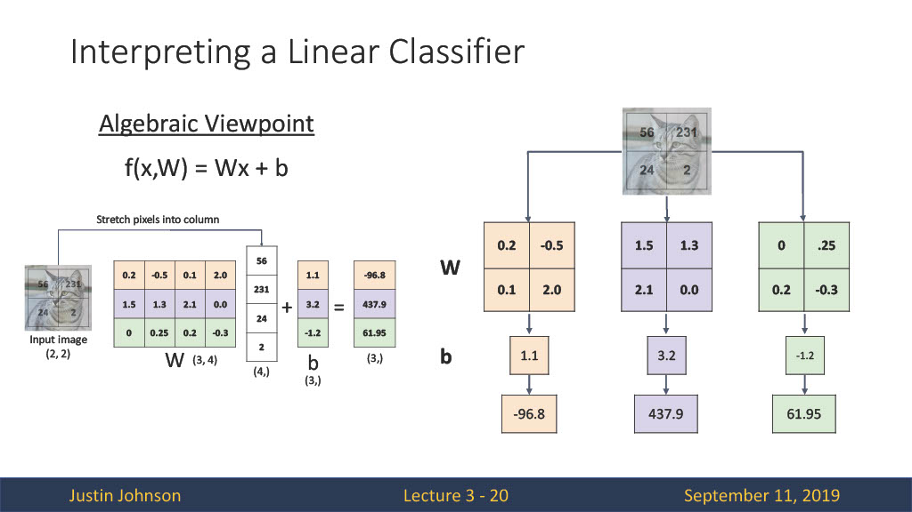

# 3. Linear Classifiers

## 선형 분류기

3장에서는 선형 분류 기법에 대해서 알아보고 이 모델이 최적의 파라미터를 가지기 위한 정량적 기법 loss function에 대해서도 알아보고자 한다.

**선형 분류기는 단순히 생각하면 직선 형태를 경계선으로 가진 분류기를 의미한다.** 위의 그림과 같이 단순한 y = wx + b의 선형 분류기 모델을 만들 수 있다. 입력 이미지로 (32,32,3)차원이 입력되고, 학습 파라미터(W, b)값이 존재한다. 이때, 이 값들의 연산은 행렬 연산이므로 차원을 맞추어 주는 것이 중요하다. 최종적으로 10개의 class에 대해 분류하고자 하니 최종 출력 차원은 (10,0)이 된다. 이에 맞게 차원을 계산하면 W = (10,3072), x = (3072,), b = (10,)이 된다.

간단하게 3개의 class score를 출력하는 행렬을 살펴보면 아래와 같다.

이제 선형 분류기를 3가지의 관점을 통해 확인해보자.

### 1. Algebraic Viewpoint

대수적 관점에서 선형 분류기는 행렬 연산을 통해 수학적으로 이해하는 것을 의미한다.

행렬의 형태로 모든 값들을 표현하면 위와 같다. W, b 값을 초기화해주고 입력값과 계산하여 최종 score를 출력한다. 이때 출력에 해당하는 (3,)차원의 행렬이 각 class에 대한 score가 된다. 위에서부터 1, 2, 3번 class라고 한다면 2번 class에 대한 score가 가장 높은 것을 확인할 수 있다. 방법에 따라 bias를 W 행렬 벡터에 추가해 주고 flatten된 입력 이미지에 1을 추가해서도 score를 계산할 수 있다.

### 2. Visual Viewpoint
Visual관점에서의 선형 분류기는 학습되는 가중치 파라미터 W가 하나의 template을 의미한다는 것이다.

위의 그림은 선형 분류기를 통해 학습된 각 class의 template이다. 여기서 의미하는 것은 만약 우리가 어떤 이미지를 예측하고자 한다면, 해당 이미지와 가장 유사한 template으로 해당 class를 예측을 하는 것이다. 하지만 하나의 template만을 사용하기 때문에 색, 방향 등에 따른 정확한 class를 예측하기 어렵다.

### 3. Geometric Viewpoint
기하학적인 관점에서 선형 분류기를 살펴보면 아래의 이미지와 같다.

공간상에는 각 class를 구별하는 선형 함수가 존재하고 이 함수들이 공간 상의 해당 점을 분류한다.

---

## 선형 분류기의 한계

위의 초록색, 파란색 점을 분류할 수 있는 한 개의 직선이 없다. 즉, 선형 분류기는 XOR 문제를 해결하지 못하는 한계를 가진다.

지금까지 선형 분류기의 전체 흐름을 보았다. 여기서 생기는 궁금증은 그럼 파라미터 W, b 값은 어떻게 선택할 수 있을까이다.
또한 **선택된 파라미터가 현재 모델에 얼마나 적합한 모델인지, 판단할 수 있는 정량적인 값**이 필요하다. 이를 위해 Loss Function이라는 개념을 도입한다.

---

## Loss Function

단순한 Loss function을 살펴보면 현재 입력 데이터 x, 가중치 파라미터 W 값을 통해 나온 y_pred 값과 입력 데이터에 대한 정답값 y값을 Loss function에 넣음으로써 loss를 계산할 수 있다. 

여기서 L에 해당하는 대표적인 Loss function의 예를 살펴보자.

## 1. SVM Loss

SVM Loss function의 식을 살펴보면 max(0, 예측 score - 정답 score + 1)의 형태이다. 즉, 현재 정답인 class의 score가 정답이 아닌 class의 score보다 높게 된다면 이는 잘 예측한 것 이므로 loss가 0이 된다. 그게 아닌 다른 값으로 예측 했다면 0보다 큰 값이 loss값이 되어 이를 더해주게 된다.

예를 통해 loss를 계산해보면 해당 이미지의 정답은 cat이고 cat에 해당하는 score는 3.2가 된다. 나머지 score들과의 계산을 통해 loss를 계산하면 각각 2.9, 0이 되고 이때의 loss는 2.9 + 0 = 2.9가 된다. 이런식으로 car, frog에 대해서도 계산을 차례대로 해보면 아래와 같이 각각의 loss가 계산되고 이들의 합을 class 수로 나눠줌으로써 전체 데이터셋에 대한 loss값을 계산할 수 있다.

만약 loss가 0이면 이때의 W값이 가장 최적인 파라미터일까? 정답은 아니다. 만약 그렇게 되면 **이 파라미터는 training set에 너무 편향되어 학습된 파라미터(overfitting)이기 때문에 새로운 데이터에 대해 좋은 성능을 보일 수 없다.** 이를 해결 하기위해 Regularization이라는 방법을 사용한다.

---
## Regularization

Regularization는 제약을 주는 것을 의미한다. 식을 보면 앞부분의 Data loss는 위에서 loss값을 구하기 위한 식이고 뒤에 R(W)값이 Regularization에 대한 식이 된다. 이 식에서의 람다값을 조절함으로써 정규화를 강하게, 약하게 줄 수 있다. R(W)의 대표적인 방법으로는 L1 regularization, L2 regularization 방법이 있다. 

### L1 regularization

L1 regularization을 알기 위해서는 L1 norm에 대해 알아야 한다. **L1 norm은 벡터 p,q가 있을 때 각 원소들의 차이의 절대값 합을 의미한다.** L1 regularization은 Data loss값에 각 **가중치 절대값의 합**을 추가하여 표현할 수 있다. 이를 통해 가중치가 너무 크지 않은 방향으로 학습되게 하는 효과를 줄 수 있다. **하지만 가중치를 업데이트하는 과정에서 가중치가 0이 될 수 있다.**

### L2 regularization

L2 regularization도 마찬가지로 L2 norm이 존재한다. **L2 norm은 각 원소의 제곱의 합**을 제곱근한 것을 의미한다. 이 항을 Data loss에 추가하여 가중치를 규제한다. 가중치를 업데이트하면서 **전체적인 가중치 값을 균등히 작게**하여 모델의 과적합을 막을 수 있다. 일반적으로 L2 regularization이 더 좋은 성능을 보인다.

위의 그림을 살펴보면 w1의 값은 L1을 적용한 값으로 특정 가중치 들이 0이 되어 가장 중요한 가중치만 남은 것을 확인할 수 있다. w2의 값은 전체적으로 균등하게 작아진 것을 확인할 수 있다.

> **Regularization**은 모델의 과적합을 막는 대표적인 방법이다. 과적합을 막는 것은 더 간단한 모델을 구현하는 것을 의미한다. **L1 regularization**은 cost function에 L1 항을 추가한 것으로 가중치를 업데이트 하면서 특정 가중치들은 0이된다. 이렇게 함으로써 모델에 큰 영향을 주는 가중치들만 남게 된다.(feture selection 가능) **L2 regularization**은 cost function에 L2항을 추가한 것으로 가중치를 업데이트하면서 전체적으로 가중치가 작아진다. 모델의 복잡도를 낮추고 큰 가중치들을 작게할 수 있고 전체적인 학습 데이터에 대해 균등하게 학습할 수 있으나 가중치를 0으로 만들지 못한다. 

위의 그림을 보면 파란색 점은 훈련 데이터를 의미한다. f1은 훈련 데이터에 딱 맞게 학습된 모델이고, f2는 f1에 비해 단순한 모델이다. f1은 테스트 데이터에 대해 일반화된 예측 능력을 보일 수 있다. 이렇듯 Regularization을 통해 모델을 더 단순하고 일반화할 수 있다.

## 2. Cross-Entropy Loss (Softmax)
Cross-Entropy는 가장 일반적으로 사용되는 Loss function이다. 이 함수는 모델에 의해 예측되는 score를 확률적으로 해석하는 것에 의미를 두고있다. 여기에서 softmax라는 함수를 추가적으로 이용한다.

처음에 각 class에 대한 예측값을 구하고 (3.2, 5.1, -1.7)이 값들을 exp 취해준다. 이때 값들을 unnormalized probabilites라고 한다. 이렇게 함으로써 score 값이 모두 양수가 나오고 지수함수이므로 추후에 미분가능한 식이 된다.

그다음으로는 확률을 계산해 준다. exp후 나온 값들의 합으로 각 score를 나눠줌으로써 해당 class일 확률을 계산한다. 모든 class에 대한 score를 확률 분포로 표현하여 해석할 수 있다. 이렇게 **exp 후 전체 합으로 나누어주는 과정을 softmax라고  한다.softmax를 통해 미분이 불가능함 함수를 가능한 함수로 바꾸어 모델을 최적화할 수 있다.**

이후 계산된 확률값을 -logP에 넣음으로써 loss 값을 계산해 준다. y = -log(x)의 그래프는 x 값이 1에 가까워질수록 loss 값이 0에 가까워지고, x 값이 1로부터 멀어질수록 loss값이 높아진다. 확률값이 1에 가까울수록 loss는 0에 가까워져야 하므로 왜 -log 값을 사용하는지 알 수 있을 거라 생각한다.

>Cross-Entropy loss에서 loss의 최소값은 0, 최대값은 inf가 된다. SVM과 비교해서 다른 점은 SVM은 정답 clss보다 높은 점수면 무조건 loss가 0이 였으나 여기서는 해당 closs일 확률이 1이어야만 loss가 0이 될 수 있다. 이를 사용하게 되면 정답 class가 선택될 확률이 1에 가까워지도록, 정답이 아닌 class가 선택될 확률은 0에 가까워지도록 가중치를 학습한다.

예시를 통해 SVM, Cross-entropy를 비교해보면 3개의 class에 대한 score가 나오고 있다. 여기서는 첫 번째 class가 정답 class이다. score = [10, -2, 3]을 보면 첫 번째 class에 대한 score가 가장 큰 것을 알 수 있다. 이때의 SVM은 loss = 0이고, Cross-entropy는 loss > 0이다. 그 아래의 score는 모두 다른 값을 가지고 있으나 모두 1번 class가 가장 크기 때문에  SVM loss = 0이 된다. 이는 다른 score를 가졌음에도 같은 loss를 가지는 문제가 발생한다.

---

