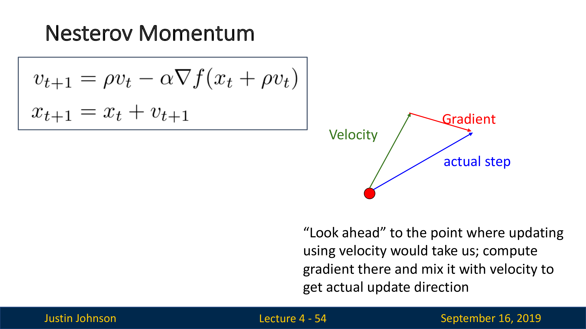
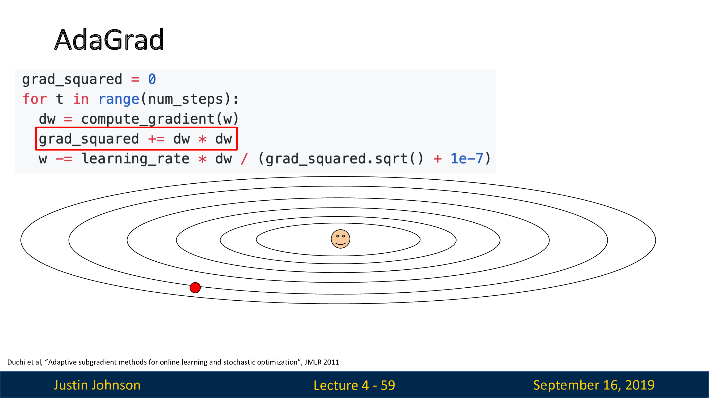
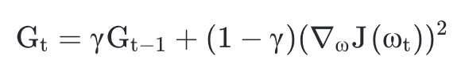
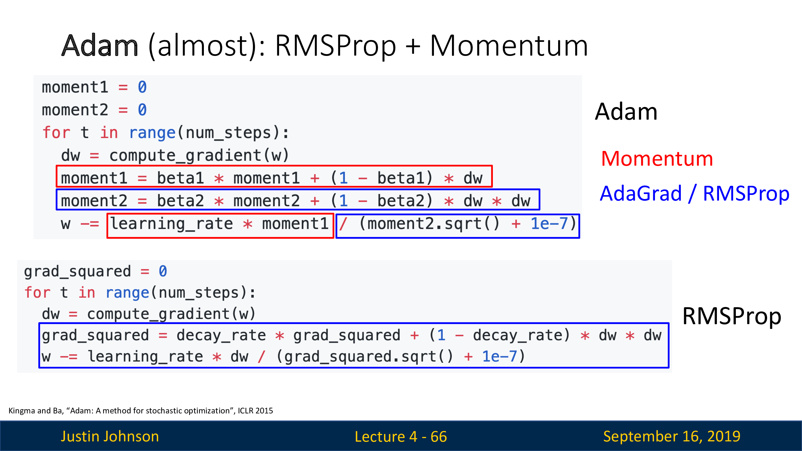
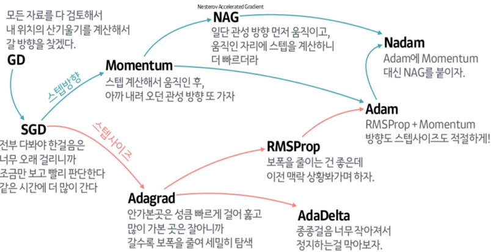

# 4. Optimization
3강에서는 Linear Classification에 대해 공부했다. 4강에서는 모델에 가장 적합한 파라미터 W값을 찾는 방법에 대해 살펴 보고자 한다.

가중치 값을 설정하는 방법으로는 **단순히 값을 random**으로 설정하는 방법이 있다. 하지만 이 방법은 나쁜 성능을 보여 사용하지 않는다. 두 번째 방법으로는 **경사를 따라가는 방법**으로 가장 크게 감소하는 방향으로 나아가는 것을 의미한다. 우리는 학습할 때 **가장 작은 loss값을 향해 가중치 w를 업데이트 해야한다.** 이때 가장 크게 감소하는 방향은 **기울기**를 뜻하고, 이는 수학적으로 **미분**을 통해 계산할 수 있다.

미분을 통해 함수의(여기서는 loss function) 최소값을 구하는 방법을 **gradient descent**라고 한다. 이때 미분을 사용하는 방법이므로 Analytic gradient라고 한다.

## Stochastic Gradient Descent(SGD)

모든 학습 데이터에 대한 파라미터를 업데이트 하게 된다면 시간이 오래 걸리고 낭비가 될 수 있다. 임의로 선택한 학습 데이터에 대해 기울기를 계산하는 방법이 SGD이다. 여기서 stochastic은 확률적이라는 용어로 랜덤하게 추출한 일부 데이터를 사용하여 gradient를 계산하는 것을 의미한다. 일부 데이터를 사용하기 때문에 빠른 속도를 가지고 있으나, 비등방성 함수에서 최적해를 찾는데 시간이 더 소요된다는 점과 local minimum의 단점을 가진다. 식에서의 N은 미니 배치를 의미하는데 이것은 전체 데이터를 모두 확인하는 것이 아닌 N개의 데이터를 통해 gradient를 계산하는 것을 의미한다.

local minimum에 빠지는 문제를 해결하기 위해 Momentum 항을 추가한다.

> ## key point
> Gradient Descent에서 **전체 데이터를 학습하면 속도가 느려지는 문제**를 해결하기 위해 **통계적으로 일부 데이터만 학습하는 아이디어를 추가했음!**

## Momentum

Momentum은 처음 gradient가 움직인 방향과 크기에 대해서 보존하는 개념이다. 학습을 진행하면서 v값이 업데이트 되고 이 값들이 추가되면서 기존보다 더 움직인다.물리학에서의 관점으로 보면 관성의 개념과 같다고 할 수 있다. 그렇기에 기존에 움직이던 것 만큼 더 움직이므로 local minimum로 부터 벗어날 수 있다. 하지만 경사가 가파른 곳을 빠른 속도로 내려오다 관성으로 인해 최소 지점을 지나치는 overshooting 현상이 발생할 수 있다. momentum을 간단하게 3가지의 스텝으로 정리하면 다음과 같다.
1. 현재 위치에서의 gradient를 구한다.
2. 이전 velocity를 가져온다.
3. 위의 1,2번 step의 방향으로 더 간다.

> ## key point
> GD, SGD 모두 **local minimum에 빠져서 최적의 값을 못 구할 수 있다.** **그래서 gradient와, velocity과 관련된 항을 추가하여 "관성"의 역할을 하는 Momentum을 만들었다.**

## Nesterov Momentum

Nesterov Momentum은 기존의 Momentum과 달리 Momentum이 적용된 지점에서의 기울기 값을 구한다. 기존의 Momentum방식은 관성에 의해 의도했던 것 보다 더 많은 지점을 움직일 수 있다. 

하지만 Nesterov Momentum은 Momentum으로 절반정도 이동한 후에 어떤 방식으로 이동할지 계산하기 때문에 Momentum의 단점을 극복할 수 있다. 따라서 현재 속도로 미리 이동한 후에 overshooting이 된 만큼 다시 내리막길로 내려온다.
 Momentum의 빠른 속도를 가지면서 제동을 주어 올바른 값을 최적화할 수 있다.

> 모멘텀 참고 사이트 
> 
> https://tensorflow.blog/2017/03/22/momentum-nesterov-momentum/
> https://hyunw.kim/blog/2017/11/01/Optimization.html

## AdaGrad

**AdaGrad는 손실 함수의 기울기 변화에 따라 적응적으로 학습률을 정하는 알고리즘이다.** 큰 폭으로 이동하며 경사를 내려올 때, 만약 경사가 가파르다면 최소 지점을 지나칠 수 있는 문제가 있다. 그렇기에 매개변수에 맞춰 학습률을 변화시키는 학습을 진행하며, 학습률을 점차 줄여간다. 많이 변화하지 않은 변수들은 학습률을 크게하고, 많이 변화한 변수들에 대해서는 학습률을 적게한다. 그 이유는 많이 변화한 변수는 최적값에 가까울 것이라는 가정하에 학습률을 조정한다. 

식을 살펴보면 1e-7의 작은 수는 learnig rate가 0으로 나누어 지는 것을 막아주는 역할을 한다. 이후 learning rate를 g(t).sqrt로 나누어 주는 것을 확인할 수 있다. 만약 dw가 작으면 작은 변화율을 가진다. 이때는 큰 learning rate로 이동하는 것이 최적화에 유리하므로 값을 나누어 learning rate를 크게 만들어 준다. 반대의 경우에는 learning rate가 작아진다. **하지만 grad_squared가 너무 커지게 된다면 가중치 업데이트가 정체될 수 있고 만약 경사가 매우 가파른 곳에서 학습을 시작하면, 초반부터 급격히 감소하다가 최적해에 도착하기 전에 조기 종료될 수 있다.**

> ## key point
> Momentum항을 추가하여도 최적의 값을 두고 진동하거나, 지나칠 수 있는 문제를 가진다. 이를 해결하기 위해 **현재 상태(dw)에 따라 learning rate를 조절하는 아이디어가 나왔다.**

## RMSProp

RMSProp는 AdaGrad에서 학습이 조기 종료되는 문제를 해결하기 위한 방법이다. 위의 AdaGrad에서 변화량이 더 클수록 learning rate가 작아져서 w의 업데이트가 조기 종료될 수 있었다. 따라서 이를 해결하기 위해 **학습률의 크기를 비율로 조정하는 파라미터를 추가했다.** 더 정확하게는 Adam에서와 같이 **기울기를 단순 누적하지 않고 지수 가중 이동 평균을 사용하여 최신 기울기들이 더 크게 반영되도록 만들었다.** 최신 기울기들이 더 크게 반영되는 것을 "지수 가중 이동평균"이라고 한다. 

위의 식에서 G_t-1에 r파라미터가 붙은 것을 확인할 수 있다. 바로 이 파라미터가 과거의 데이터를 얼마나 반영할 것인가에 대한 파라미터이다. 만약 r=1이면 바로 이전 데이터를 전부 반영하는 것이고, 0이면 이전 데이터를 반영하지 않는 것이다. 보통은 0.9를 많이 사용한다고 한다. 이 파라미터가 클수록 과거의 데이터를 더 반영하므로 전체적인 평균을 구할 수 있다. 약간 일반화하는 개념과 비슷하다고 생각된다.

## Adam

Adam알고리즘은 Momentum과 RMSProp의 방법을 합친 최적화 알고리즘이다.

> Adam 참고 사이트 
> 
> https://dalpo0814.tistory.com/29

https://onevision.tistory.com/entry/Optimizer-%EC%9D%98-%EC%A2%85%EB%A5%98%EC%99%80-%ED%8A%B9%EC%84%B1-Momentum-RMSProp-Adam

https://zzsza.github.io/data/2018/05/20/cs231n-training_neural_networks_2/